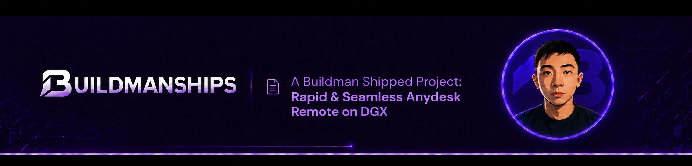

<p align="center">
  
</p>

# DGX Spark — adaptive display + AnyDesk remote runbook

Rapid, repeatable headless Any Desk remote access for **NVIDIA DGX Spark / GB10 units on Ubuntu 24.04
ARM64 (DGX OS)**: Autonomously deploy a dummy X screen when no monitor is attached, the unit's own monitor
config when one is present, switched automatically so that anydesk can connect to the screen available seamlessly for remote access work. Without it Anydesk remote access is not available if no physical monitor is connected to the DGX Spark.

Point a new unit at [`docs/06-new-unit-runbook.md`](docs/06-new-unit-runbook.md).

---

## Source of truth

[`Manual-Direct-commands.txt`](Manual-Direct-commands.txt) is the procedure that was built
and validated on `dxclabs-dgxspark`. Everything in `scripts/` and `config/` is extracted
from it; `docs/` explains it. **If a file here disagrees with that one, that one wins.**

Content that is *not* from that procedure is marked as such at the top of the page. Today
that is: `docs/03-anydesk-install.md`, `scripts/install-anydesk.sh`, `scripts/preflight.sh`
and `scripts/healthcheck.sh`.

## How it works

```
/etc/X11/display-modes/physical.conf   the unit's own DGX OS xorg.conf (Driver "nvidia")
/etc/X11/display-modes/headless.conf   dummy driver, 1920x1080
                  |
/usr/local/sbin/display-mode.sh
   boot   -> wait up to 30s for nvidia-smi, pick the config, before GDM starts
   watch  -> poll every 5s; switch config + restart GDM when the state changes
                  |
display-mode.service   ExecStartPre=... boot / ExecStart=... watch / Restart=always
```

Monitor detection is `nvidia-xconfig --query-gpu-info` → *Number of Display Devices*.

| Parameter | Value | Effect |
|---|---|---|
| `POLL` | `5` | Seconds between checks |
| `PLUG_POLLS` | `2` | ~10 s of monitor present → physical |
| `UNPLUG_POLLS` | `24` | ~120 s of monitor absent → headless |

Fast in, slow out: every switch restarts GDM and logs the desktop out, so a monitor blip
must not be able to bounce the box.

## Quick start (on the unit, over SSH)

> Over **SSH**, never over AnyDesk — switches restart the display manager.

```bash
git clone <this-repo-url> dgx-display-mode && cd dgx-display-mode
sudo ./scripts/preflight.sh              # reports, changes nothing
sudo ./scripts/install-display-mode.sh   # installs; nothing switches until reboot
# unplug any monitor, then:
sudo reboot
# ssh back in:
./scripts/verify-display-mode.sh
sudo ./scripts/install-anydesk.sh --set-password --open-firewall
./scripts/healthcheck.sh

sudo ./scripts/rollback.sh               # back to stock (DESTRUCTIVE, reboots)
```

## Repo layout

| Path | What it is |
|---|---|
| `Manual-Direct-commands.txt` | **The validated procedure. Source of truth** |
| `docs/01-overview.md` | The mechanism, the timing, the boot ordering |
| `docs/02-prerequisites.md` | What must be true before you start |
| `docs/03-anydesk-install.md` | AnyDesk arm64 + unattended access *(not validated here)* |
| `docs/04-display-modes.md` | The two Xorg configs |
| `docs/05-switcher.md` | `display-mode.sh` and its service |
| `docs/06-new-unit-runbook.md` | **The path for a new unit** |
| `docs/07-verification.md` | Steps 7–8, with what each check proves |
| `docs/08-troubleshooting.md` | Sequential diagnostics — follow the branches |
| `scripts/display-mode.sh` | Extracted verbatim from the manual procedure |
| `scripts/install-display-mode.sh` | Automates manual Steps 1–5 |
| `scripts/verify-display-mode.sh` | Manual Step 7, as one command |
| `scripts/rollback.sh` | The manual Rollback line |
| `scripts/preflight.sh`, `scripts/healthcheck.sh` | Additions: pre-checks and a pass/fail gate |
| `config/headless.conf`, `config/display-mode.service` | Extracted verbatim |
| `UNIT-INVENTORY.md` | Per-unit record |

## Known behaviour

- Every switch restarts GDM, so any open desktop session — local or AnyDesk — is logged out.
  SSH, tmux, containers and model jobs are unaffected.
- The headless desktop is software-rendered. CUDA and compute workloads are untouched.
- A monitor that drops its signal when powered off counts as unplugged, and the unit goes
  headless 120 s later. Raise `UNPLUG_POLLS` if that is a problem on site.

## Contributors

See [`CONTRIBUTORS.md`](CONTRIBUTORS.md).
